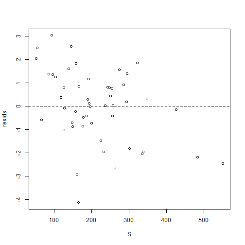
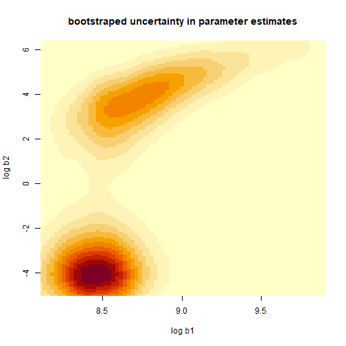

```r
# Fitting Models to Data in R

# Colin Millar, modified from Iago Mosqueira and Ernesto Jardim

# This script shows the steps followed to fit a stock-recruitment model to
# in the file 'northern_shelf_haddock_SR.csv'


#==============================================================================
# Load and explore data
#==============================================================================

# load data from comma-separated file to data.frame
haddock <- read.csv(file = '02_Model_fitting/northern_shelf_haddock_SR.csv', header = TRUE)
```

```
## Warning in file(file, "rt"): cannot open file
## '02_Model_fitting/northern_shelf_haddock_SR.csv': No such file or directory
```

```
## Error in file(file, "rt"): cannot open the connection
```

```r
# take a look at what we have
head(haddock) # this looks at the first 6 rows
```

```
##     yc     ssb       rec
## 1 1972 293.120  8738.656
## 2 1973 274.699 32331.910
## 3 1974 321.906 50765.467
## 4 1975 157.703  3121.856
## 5 1976 193.539  5393.141
## 6 1977 348.050 11907.538
```

```r
str(haddock) # this lets us inspect what the columns contain
```

```
## 'data.frame':	50 obs. of  3 variables:
##  $ yc : int  1972 1973 1974 1975 1976 1977 1978 1979 1980 1981 ...
##  $ ssb: num  293 275 322 158 194 ...
##  $ rec: num  8739 32332 50765 3122 5393 ...
```

```r
# lets rename some columns because I am lazy and want the code to be
# readable and easier to type
names(haddock)
```

```
## [1] "yc"  "ssb" "rec"
```

```r
names(haddock) <- c("yc", "ssb", "rec")
head(haddock)
```

```
##     yc     ssb       rec
## 1 1972 293.120  8738.656
## 2 1973 274.699 32331.910
## 3 1974 321.906 50765.467
## 4 1975 157.703  3121.856
## 5 1976 193.539  5393.141
## 6 1977 348.050 11907.538
```

```r
# to access the diffrent columns use '$' i.e to see the SSB values:
haddock$ssb
```

```
##  [1] 293.120 274.699 321.906 157.703 193.539 348.050 158.339  93.237 103.372 192.108
## [11] 426.693 295.226 237.031 166.700 285.507 161.662 125.842 177.242  85.160  51.828
## [21]  55.015 117.925 138.404 195.770 125.611 255.801 186.995 145.643  95.954  66.008
## [31] 550.753 482.786 338.047 254.992 177.633 148.434 301.827 250.312 232.743 165.311
## [41] 334.919 263.066 190.277 149.626 127.240 224.216 200.462 247.936 243.433 256.765
```

```r
# and to see observed recruitment
haddock$rec
```

```
##  [1]  8738.656 32331.910 50765.467  3121.856  5393.141 11907.538 24519.908 48276.386
##  [9]  8994.401 15261.807  9232.003 29543.509  5949.746  9642.389 17814.510   210.743
## [17]  1115.116  1853.396  8410.272  9933.569 16817.751  4286.522 16989.806  4782.853
## [25]  6840.430  4193.095  3077.120 46584.026  9156.133   920.372  1164.424  1326.733
## [33]  1192.405 13297.296  2738.267  1799.180  1221.123  9633.460   804.222    65.563
## [41]  1082.830   457.363  6285.135  1557.364  2910.963  1257.282  2402.113 13559.848
## [49] 13682.503  6640.480
```

```r
# initial plot of SSB vs. recruits
plot(
  rec ~ ssb,
  data = haddock, # look in haddock for x and y values
  xlab = "Spawners (kt)",
  ylab = "Recruits (millions age 0)"
)
```


```r
# probably better to set x and y limits to start at zero
plot(
  rec ~ ssb,
  data = haddock, # look in haddock for x and y values
  xlim = c(0, max(ssb)), # set x limits
  ylim = c(0, max(rec)), # set y limits
  xlab = "Spawners (kt)",
  ylab = "Recruits (millions age 0)"
)
```


```r
###############################################################################
# Some haddocke to mimic what was done in the lecture
###############################################################################

# estimate the mean
####################

# analytical solution
mu <- sum(haddock$rec) / length(haddock$rec)

# define a range of estimates to try
mu_hat <- seq(8000, 10500, by = 250)

# create a matrix of residuals, like in the spreadsheet
recruits <- matrix(haddock$rec, nrow = length(haddock$rec), ncol = length(mu_hat), byrow = FALSE)
mu_hats <- matrix(mu_hat, nrow = length(haddock$rec), ncol = length(mu_hat), byrow = TRUE)

residuals <- recruits - mu_hats

SSQ <- colSums(residuals^2)

# plot the sums of squares line
plot(mu_hat, SSQ, col = "red", lwd = 2, type = "l")
points(mu_hat, SSQ, col = "red", pch = 16)
abline(v = mu, col = "blue")
```


```r
# estimate the mean
####################

# analytical solution
b <- sum(haddock$rec * haddock$ssb) / sum(haddock$ssb^2)

# define a range of estimates to try
b_hat <- seq(31, 41, by = 1)

# create a matrix of residuals, like in the spreadsheet
recruits <- matrix(haddock$rec, nrow = length(haddock$rec), ncol = length(b_hat), byrow = FALSE)
spawners <- matrix(haddock$ssb, nrow = length(haddock$rec), ncol = length(b_hat), byrow = FALSE)
b_hats <- matrix(b_hat, nrow = length(haddock$rec), ncol = length(b_hat), byrow = TRUE)

residuals <- recruits - spawners * b_hats

SSQ <- colSums(residuals^2)

# plot the sums of squares line
plot(b_hat, SSQ, col = "red", lwd = 2, type = "l")
points(b_hat, SSQ, col = "red", pch = 16)
abline(v = b, col = "blue")
```


```r
# here is a quick attempt at turning this into a function

ssq_2 <- function(b, recruits, spawners) {
  residuals <- recruits - spawners * b
  sum(residuals^2)
}

plot(
  b_hat,
  sapply(b_hat, ssq_2, recruits = haddock$rec, spawners = haddock$ssb),
  type = "l"
)
```


```r
###############################################################################
# We are now going to demonstrate the same techniques employed in the spreadsheet
# solution to the assignment
###############################################################################

#==============================================================================
# Beverton and holt recruitmet model R=b1*S/(b2+S)
#==============================================================================
```

```r
# (1) Calculate predicted R for each year
# Rpred = b1 * S / (b2 + S)
```

```r
# starting values for b1 and b2
a <- 1
b <- 1

# set up the other variables (i.e. S)
S <- haddock$ssb

Rpred <- a * S / (b + S)
```

```r
# (2) Calculate log residuals, Ln(obs/pred)
```

```r
# assign observed recruitment
Robs <- haddock$rec

resids <- log(Robs / Rpred) # = log(Robs) - log(Rpred)

# note that in R, log is the natural log:
?log # see the help file for the log function
log(exp(1))
```

```
## [1] 1
```

```r
log(exp(10))
```

```
## [1] 10
```

```r
# (3) Calculate sum of squared residuals
```

```r
?sum # see the help file for sum
ssq_resids <- sum(resids^2)
```

```r
# (4) Minimize sum-of-squares with solver by adjusting a and b
```

```r
# to do this, we need to set up a function that takes
# a and b as input, and returns the sums of squared residuals

# in R a function is a collection of steps: i.e.
add <- function(b1, b2) {
  b1 + b2
}
add(1, 2)
```

```
## [1] 3
```

```r
# 3

# the sums of squares function is collection of the previous 3 steps:
ssq <- function(a, b) {
  # 1. Calculate predicted R for each year
  Rpred <- a * S / (b + S)
  # 2. Calculate log residuals, Ln(obs/pred)
  resids <- log(Robs / Rpred)
  # 3. Calculate sum of squared residuals
  ssq_resids <- sum(resids^2)

  # return
  ssq_resids
}

# lets test this out:
ssq(a, b)
```

```
## [1] 3676.268
```

```r
ssq(1, 1)
```

```
## [1] 3676.268
```

```r
ssq(2, 1)
```

```
## [1] 3113.88
```

```r
# now we need to search over lots of values for b1 and b2 to
# find the minimum.
# There are lots of ways to do this, we will first look at the optim function.
# the help file for optim is:
?optim

ssq_optim <- function(par) {
  a <- par[1]
  b <- par[2]

  ssq(a, b)
}

# use c to combine the starting values into a vector
?c
par0 <- c(1, 1)

# lets test the new ssq funciton
ssq_optim(par0)
```

```
## [1] 3676.268
```

```r
# lets run it..
opt <- optim(par0, ssq_optim)
```

```
## Warning in log(Robs/Rpred): NaNs produced

## Warning in log(Robs/Rpred): NaNs produced

## Warning in log(Robs/Rpred): NaNs produced

## Warning in log(Robs/Rpred): NaNs produced

## Warning in log(Robs/Rpred): NaNs produced

## Warning in log(Robs/Rpred): NaNs produced

## Warning in log(Robs/Rpred): NaNs produced

## Warning in log(Robs/Rpred): NaNs produced

## Warning in log(Robs/Rpred): NaNs produced

## Warning in log(Robs/Rpred): NaNs produced

## Warning in log(Robs/Rpred): NaNs produced

## Warning in log(Robs/Rpred): NaNs produced

## Warning in log(Robs/Rpred): NaNs produced

## Warning in log(Robs/Rpred): NaNs produced

## Warning in log(Robs/Rpred): NaNs produced

## Warning in log(Robs/Rpred): NaNs produced

## Warning in log(Robs/Rpred): NaNs produced

## Warning in log(Robs/Rpred): NaNs produced

## Warning in log(Robs/Rpred): NaNs produced

## Warning in log(Robs/Rpred): NaNs produced

## Warning in log(Robs/Rpred): NaNs produced

## Warning in log(Robs/Rpred): NaNs produced

## Warning in log(Robs/Rpred): NaNs produced

## Warning in log(Robs/Rpred): NaNs produced

## Warning in log(Robs/Rpred): NaNs produced

## Warning in log(Robs/Rpred): NaNs produced

## Warning in log(Robs/Rpred): NaNs produced
```

```r
opt
```

```
## $par
## [1] 28215.3652   834.7782
## 
## $value
## [1] 111.9657
## 
## $counts
## function gradient 
##      319       NA 
## 
## $convergence
## [1] 0
## 
## $message
## NULL
```

```r
# it didn't do so well....  lets try with different starting values:
opt <- optim(c(32000000, 300), ssq_optim)

opt
```

```
## $par
## [1] 30322187  1222440
## 
## $value
## [1] 116.886
## 
## $counts
## function gradient 
##       39       NA 
## 
## $convergence
## [1] 0
## 
## $message
## NULL
```

```r
# better now :)
```

```r
# (5) Plot observed and predicted R
```

```r
# get the parameter estimates from the optimisation
a <- opt$par[1]
b <- opt$par[2]

# predict recruitment
Rpred <- a * S / (b + S)

# plot
plot(Robs ~ S,
  xlim = c(0, max(S)), # set x limits
  ylim = c(0, max(Robs)), # set y limits
  xlab = "Spawning Stock Biomass (tonnes)",
  ylab = "Age-0 Recruitment"
)

# add predictions to the plot
points(Rpred ~ S, col = "red", pch = 2)
```


```r
# (6) Plot residuals
```

```r
# calculate residuals
resids <- log(Robs / Rpred)

# plot them
plot(resids ~ S)
# add in a reference line
abline(h = 0, lty = 2)
```



```r
###############################################################################
# We are now going to demonstrate the same solution, but taking advantage of
# the tools provided by a programming / scripting language
###############################################################################

#==============================================================================
# Beverton and holt recruitmet model R=b1*S/(b2+S)
#==============================================================================
```

```r
# (1) Calculate predicted R for each year
# Rpred = b1 * S / (b2 + S)
```

```r
# this time we will write a function to do this called bevholt
#  to be safe we will also pass in S
#  this way we know for sure wha values of S are being used

bevholt <- function(b, S) {
  b[1] * S / (b[2] + S)
}

# compute R at the starting values for b1 and b2
Rpred <- bevholt(c(1, 1), S = haddock$ssb)

# lets jump to step 4 ...
```

```r
# (4) Minimize sum-of-squares with solver by adjusting b1 and b2
```

```r
# now lets modify the ssq function to accept S and Robs,
# and use the function bevholt

# the sums of squares function is collection of the previous 3 steps:
ssq <- function(b, S, Robs) {
  # 1. Calculate predicted R for each year
  Rpred <- bevholt(b, S)
  # 2. Calculate log residuals, Ln(obs/pred)
  resids <- log(Robs / Rpred)
  # 3. Calculate sum of squared residuals
  ssq_resids <- sum(resids^2)

  # return
  ssq_resids
}

# lets test this out:
ssq(c(a, b), haddock$ssb, haddock$rec) # what to you notice this time?
```

```
## [1] 116.886
```

```r
ssq(c(1, 1), haddock$ssb, haddock$rec)
```

```
## [1] 3676.268
```

```r
ssq(c(2, 2), haddock$ssb, haddock$rec)
```

```
## [1] 3118.604
```

```r
# now we need to search over lots of values for b1 and b2 to
# find the minimum.

ssq_optim <- function(par, S, Robs) {
  b <- exp(par)

  ssq(b, S, Robs)
}

# use c to combine the starting values into a vector
par0 <- log(c(1, 1))

# lets test the new ssq funciton
ssq_optim(par0, S = haddock$ssb, Robs = haddock$rec)
```

```
## [1] 3676.268
```

```r
# lets run it..
opt <- optim(par0, ssq_optim, S = haddock$ssb, Robs = haddock$rec)

opt
```

```
## $par
## [1]  8.453842 -9.771247
## 
## $value
## [1] 97.53391
## 
## $counts
## function gradient 
##       55       NA 
## 
## $convergence
## [1] 0
## 
## $message
## NULL
```

```r
# the fit is not quite there yet, so lets try better starting values.
# this highlights the presence of multiple 'local' minima
par0 <- c(20, 5)
opt <- optim(par0, ssq_optim, S = haddock$ssb, Robs = haddock$rec)

opt
```

```
## $par
## [1]   8.454533 -10.323455
## 
## $value
## [1] 97.53392
## 
## $counts
## function gradient 
##      145       NA 
## 
## $convergence
## [1] 0
## 
## $message
## NULL
```

```r
# (5) Plot observed and predicted R
```

```r
# predict recruitment over the full S range
Spred <- seq(0, max(haddock$ssb), length.out = 100)
Rpred <- bevholt(exp(opt$par), S = Spred)

# plot
plot(rec ~ ssb,
     data = haddock, # pass in data this time
     xlim = c(0, max(S)), # set x limits
     ylim = c(0, max(Robs)), # set y limits
     xlab = 'Spawning Stock Biomass (tonnes)',
     ylab = 'Age-0 Recruitment')

# add predictions to the plot as a line
lines(Rpred ~ Spred, col = "red", pch = 2)
```


```r
###############################################################################
# The following is to demonstrate a techniques for calculating confidence
# intervals - this is not part of the course and purely for demonstation
# purposes
###############################################################################

# Bootstrapping is so called because it is like you are acheieving something
# from nothing.
#
# but in fact it is taking advantage of the fact that your samle of data
# contains information about how it varies...
#
# this can be seen from the residuals:

# lets run the fit again
fit <- optim(par0, ssq_optim, S = haddock$ssb, Robs = haddock$rec)

# and calculate the residuals
Rpred <- bevholt(exp(fit$par), haddock$ssb)
resids <- log( haddock$rec / Rpred)

# and plot a histogram
hist(resids, nclass = 20)
```


```r
# the mean of the residuals is:
mean(resids)
```

```
## [1] -0.0004737224
```

```r
# but is there not error in this?

# resample from this as if the resuduals are random and reclaculate the mean
r_star <- sample(resids,  replace = TRUE)
mean(r_star)
```

```
## [1] 0.2317056
```

```r
# do it again
r_star <- sample(resids, replace = TRUE)
mean(r_star)
```

```
## [1] -0.1670062
```

```r
# do it lots of times!
rmean_star <-
  replicate(10000, {
    r_star <- sample(resids, replace = TRUE)
    mean(r_star)
  })

hist(rmean_star)
```


```r
# so we are able to access the error inherent in the model fit?
#
# And we can propagate this through to the parameter estimates?
```

```r
# resample from the residuals as if the resuduals are random and reestimate the
# parameters
r_star <- sample(resids, replace = TRUE)
opt <- optim(par0, ssq_optim, S = haddock$ssb, Robs = Rpred + r_star)
opt$par
```

```
## [1]  8.455668 -1.067204
```

```r
# do it again
r_star <- sample(resids, replace = TRUE)
opt <- optim(par0, ssq_optim, S = haddock$ssb, Robs = Rpred + r_star)
opt$par
```

```
## [1]  8.455668 -1.067204
```

```r
# do it lots of times!
par_star <-
  replicate(10000, {
    r_star <- sample(resids, replace = TRUE)
    opt <- optim(par0, ssq_optim, S = haddock$ssb, Robs = Rpred * exp(r_star),
                 method = "BFGS")
    opt$par
  })

# separate b1 and b2 bootstrap simulations for ease of inspection
b1_star <- exp(par_star[1,])
b2_star <- exp(par_star[2,])

# plot histograms of simulations
hist(log(b1_star), nclass = 50)
# add confidence intervals
abline(v = quantile(log(b1_star), c(0.025, 0.975)), col = "red")
```


```r
quantile(b1_star, c(0.025, 0.975))
```

```
##     2.5%    97.5% 
##  3324.24 19952.52
```

```r
# what does the 2D bootstrap simulation look like?
plot(log(b1_star), log(b2_star), pch = ".", col = grey(.5, alpha = 0.5))
```


```r
# a colourful 2d densty plot
image(MASS::kde2d(log(b1_star), log(b2_star), n = 400),
      xlab = "log b1", ylab = "log b2",
      xlim = quantile(log(b1_star), c(0.025, 0.975)),
      ylim = quantile(log(b2_star), c(0.025, 0.975)),
      main = "bootstraped uncertainty in parameter estimates")
# plot the least squares estimate
points(fit$par[1], fit$par[2], pch = 16, col = "blue")
```



```r
# plot
# predict recruitment over the full S range
Spred <- seq(0, max(haddock$ssb), length.out = 100)
Rpred <- apply(par_star, 2, function(x) bevholt(exp(x), S = Spred))

# plot a few curves to see the uncertainty in the relationship
matplot(Spred, Rpred[, sample(1:ncol(Rpred), 100)], type = "l", lty = 1, col = grey(0.5, alpha = 0.5),
        xlim = c(0, max(S)), # set x limits
        ylim = c(0, max(Robs)), # set y limits
        xlab = 'Spawning Stock Biomass (tonnes)',
        ylab = 'Age-0 Recruitment',
        main = "boostraped error in stock recruitment relationship")
# add the data
points(haddock$ssb, haddock$rec, type = "b", pch = 16, col = "red")
```


